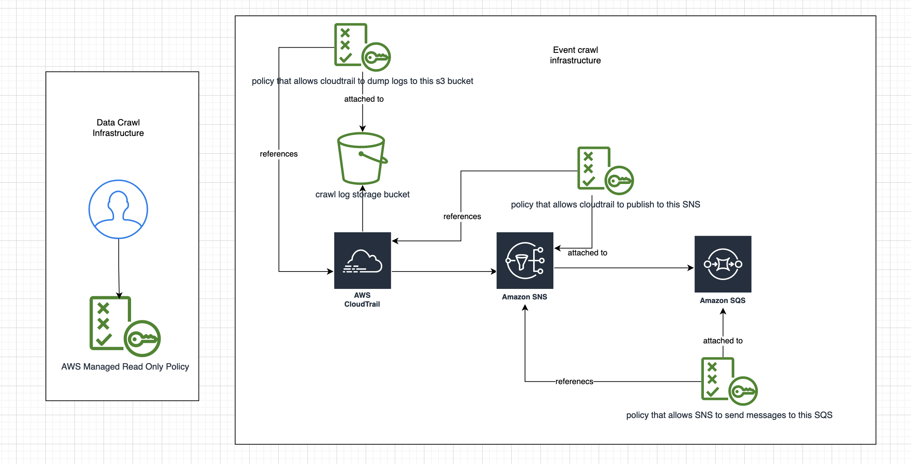

The purpose of this terraform module is to be able to create those resources in the aws account to be crawled that are needed by Kaleidoscope's aws blueprint.

This readme describes the usage of said module as well the resources that are created and their need.

# Usage of this module

The ```main.tf``` file shows how to import this module, we use terraform's concept of local modules for now.

The variables needed by the module and their description can be seen in [the variables file](./kscope_crawl/variables.tf). All of these variables basically are used to customize the names of the created resources. (You can see a detail of these resources and their need in the next section). All of the variables have sane default values, except ```bucket_name``` which is required.

The module outputs four variables, which are used to configure the aws blueprint. You can see the descriptions of ouputs in [the output file](./kscope_crawl/output.tf)

You must output these variables again in your root module, as shown in the ```ouput``` blocks of [the main file](./main.tf). 

All of the output values will be shown when you run the apply except the ```secretKey``` value since that is a sensitive value so terraform by default hides it. You can run ```terraform output --json``` to show all output values in JSON format which will show the ```secretKey```.

# Infrastructure needed for crawling
The infrastrucutre needed for crawling can be divided into two parts:

## Data Crawl Infrastructure
Data crawls are the meat of the crawler, they crawl all the resources in the aws account. For data crawls to work we need the following infrastructure

1. An aws iam user that with its access keys. It has the AWS managed ReadonlyPolicy attached to it which allows it to only read all the resources in the account.

## Event Crawl Infrastructure

Event crawls crawl the events produced by AWS and relate them to the aws resources crawled by the data crawls to produce an amalgamated data lake capable of providing even more powerful insights. 

For event carwls to work we need the following infrastructure
1. S3 bucket: An s3 bucket that is used by cloud trail for storing its logs. It also attaches relevant policies allowing the cloudtrail to access this bucket.
2. Cloudtrail: A multi region cloud trail with global service events enabled. It also sends notifications to an SNS topic when it dumps a new logs file. It also enables [data events for S3](https://docs.aws.amazon.com/awscloudtrail/latest/userguide/logging-data-events-with-cloudtrail.html), but it excludes the bucket that receives the event dump files from being included in events becaus that would result in an infinite cycle of events. **Note** If you have other cloudtrails logging stuff in your account then make sure you manually exclude the log buckets of those trails from the trail that this module creates. 
3. SNS topic:  This topic is used by the cloudtrail to send a notification to whenever cloudtrail dumps a new events log file in S3. This is needed because the optimal way to get events from cloudtrail is to use the JSON based event log files that cloudtrail dumps in the S3 bucket. To get notified whenever a new dump is done, we have to use SNS. We also create and SNS polocy for this topic that allows Cloudtrail to publish notifications to this topic.
4. SQS: This is subscribed to the SNS topic and this is what out crawler polls periodically to receive the name of the latest log dump file. We also create and attach a relevant IAM policy that allows our SNS topic to sent messages to this SQS.




# Setting up events in AWS manually

This is not needed anymore since we have this terraform module doing the creation and management for us but this is still kept here for legacy reasons.

## Creating the trail

1. Go to the AWS Cloudtrail Dashboard.
2. Click `Create trail` to jump to the trail creation form.
3. Fill in the relevant information as you see fit.
4. Specifically, turn on SNS notifications by checking `SNS notification delivery`,
   and select an existing topic or create a new one. Please make sure that this topic is not used for any other purpose accross the account.
5. On the next screen, turn on both `Management` and `Data` events.
6. For management events
   1. Check both `Read` and `Write` events.
7. For data events
   1. In the Data event source dropdown select `S3`
   2. Select `Read` and `Write` for all current and future S3 buckets.
8. Click `Next` at the bottom right to jump to the next page that will show you the details of the trail.
9. If everything looks good, click `Save` to create the trail.

## Setting up SQS to receive event notifications

1. Go to SQS Dashbaord.
2. Click `Create queue`.
3. The type of queue should be set to `Standard`. Leave other settings to default.
4. Click on `Create queue` on the bottom right of the screen.
5. It should take you to the newly created queue's dashboard. If it does not, go to SQS dashabord, click on Queues, and then click on the queue that you just created.
6. On the bottom right, click on `Subscribe to Amazon SNS topic` and select the SNS topic ARN that you created in step 4 of "creating the trail".
7. Click `Save` to finalize.
8. The URL of this SQS shall be used to configure the AWS blueprint in your Kaleidoscope deployment.

**Note:** If you have multiple deployment of Kaleidosope that monitor the same AWS account, make sure that you have separate queues for each of those deployments since SQS allows a message to be read only once. Having multiple queues is fairly simple, just follow the steps
above to create another queue, and subscribe it to the same SNS topic ARN.

## Preventing cyclical event generation

Cyclical event generation occurs because Cloudtrail sends the logs to an S3 bucket, and when you have data events enabled for S3, that logging will get recorded as a separate event, which will again be logged and thus generate another event, and so on. To prevent this, follow the following steps:

1. Go to `Trails` menu from Cloudtrail Dashboard and click on the trail you have configured to use with Kaleidoscope.
2. Click on `Edit` button atop the Data events subsection.
3. Scroll down and click on `Switch to Advanced Data Selectors`
4. Select `S3` from the Data event type dropdown.
5. Select `Custom` from the Log selector template dropdown.
6. Select `resources.ARN` from the field dropdown.
7. Select `does not start with` from the operator dropdown.
8. Click on `Browse` and select the S3 bucket that you have configured to send the logs of this particular Cloudtrail to. You might also want to select S3 buckets for other Coudtrails, in case you have multiple Cloudtrails enabled.