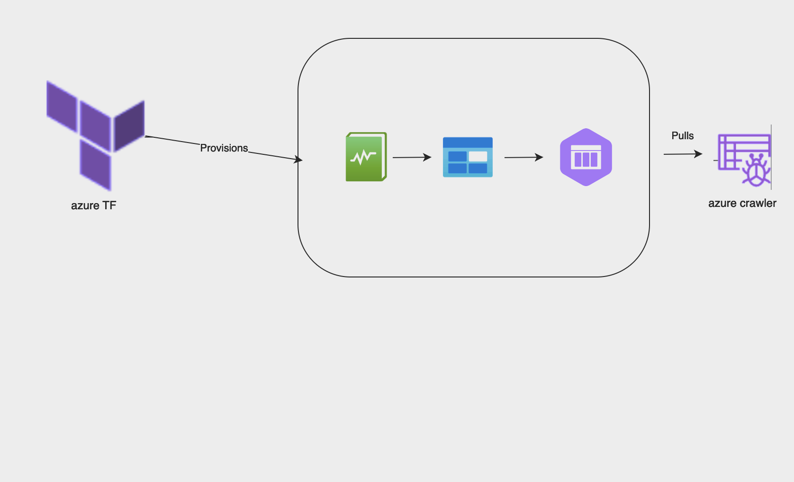

# Azure Terraform Module

## Overview

The script sets up an Azure storage account, container, and queue, and enables diagnostic logging and metrics for the storage account. It also creates an Azure AD application with a display name of `kaleidoscope-blueprint` and assigns an owner based on the `object_id` of the current client configuration. It specifies a required resource access to a specific scope. The script provides outputs to retrieve information about the created resources.

# Usage of this script

This Terraform script defines infrastructure as code to deploy an Azure storage account and an Azure Active Directory (AD) application. It enables diagnostic logging and metrics for the storage account and provides outputs to retrieve important information about the created resources.

## Prerequisites

- Terraform installed
- Azure CLI configured and authenticated
- Appropriate permissions in Azure Active Directory (Application Administrator or Global Administrator role)

## Variables

| Name                   | Description                                                                      | Type   | Default Value | Required |
|------------------------|----------------------------------------------------------------------------------|--------|---------------|----------|
| azure_subscription_id  | The Azure subscription ID where resources will be created.                       | string | -             | Yes      |
| azure_region           | The Azure region where resources will be deployed.                               | string | "eastus"      | No       |
| client_id              | The client ID of the Azure AD application.                                        | string | -             | Yes      |
| client_secret          | The client secret of the Azure AD application.                                    | string | -             | Yes      |
| storage_account_name   | The name of the Azure storage account to be created.                              | string | "k6scopemystorageaccount" | No       |
| storage_container_name | The name of the storage container to be created.                                  | string | "k6scopemycontainer"      | No       |
| storage_queue_name     | The name of the storage queue to be created.                                      | string | "kscopemyqueue"           | No       |

## Permissions Needed

Ensure that the account used to run the Terraform script has the following permissions:

- Contributor role or equivalent permissions on the Azure subscription.
- Application Administrator or Global Administrator role in Azure Active Directory.

## Usage

1. Clone the repository to your local machine.
2. Navigate to the `azure` module directory.
3. Configure the required variables in the `variables.tfvars` file.
4. Run `terraform init` to initialize the Terraform configuration.
5. Run `terraform plan -var-file="variables.tfvars"` to review the planned infrastructure changes.
6. Run `terraform apply -var-file="variables.tfvars"` to apply the configuration and provision the resources.
7. After successful provisioning, the outputs will be displayed. Make note of the relevant information for further use.

## Data Crawl

Data crawls are the meat of the crawler, they crawl all the resources in the Azure account. For data crawls to work we need the following infrastructure:

1. **Azure AD Application**: The `azuread_application` resource creates an Azure AD application with a display name of `kaleidoscope-blueprint` and assigns an owner based on the `object_id` of the current client configuration. It assigns these permission roles using MS Graph to the app:
    - `User.Read.All`
    - `Group.Read.All`
    - `RoleManagement.Read.All`

## Event Crawl

Event crawls ingest the events produced by Azure and bind them to the Azure resources crawled by the data crawls to produce a 360 degree view capable of providing more powerful insights. 

For event crawls to work we need the following infrastructure:

- **Resource Group**: A resource group named `kaleidoscope-storage-rg` is created in the `eastus` location.
- **Storage Account**: An Azure storage account named `k6scopemystorageaccount` is created within the resource group. It uses the `Standard` tier and `LRS` replication type.
- **Storage Container**: A storage container named `k6scopemycontainer` is created within the storage account. It has private access.
- **Storage Queue**: A storage queue named `kscopemyqueue` is created within the storage account.

### Diagnostic Logging and Metrics

A diagnostic setting named `kaleidoscope-storage-account-logs` is created to enable logging for the storage account. It targets the blob service of the storage account and enables logging for categories such as StorageRead, StorageWrite, StorageDelete, and AllMetrics. The retention policy for all logs is set to disabled.

### Diagram

## Cleanup

To destroy the created resources and clean up, run `terraform destroy -var-file="variables.tfvars"` in the `azure` module directory.

**Note:** Ensure that you have backed up any important data stored in the provisioned resources before executing the destroy command.